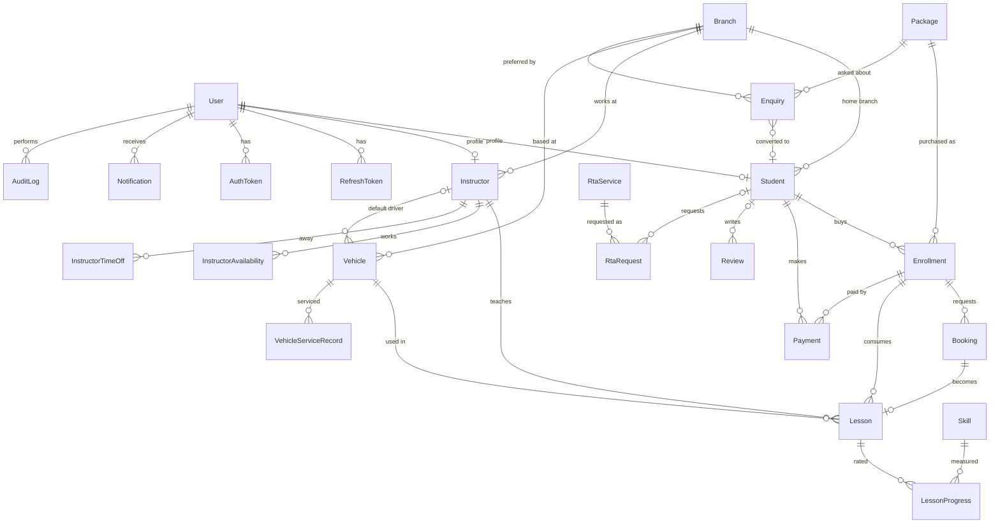

# Database design

Source of truth: [`server/prisma/schema.prisma`](../server/prisma/schema.prisma) and the two migrations in
`server/prisma/migrations/`. This document explains the model; if they disagree, the schema wins.

## Conventions

| Topic          | Rule                                                                                                                           |
| -------------- | ------------------------------------------------------------------------------------------------------------------------------ |
| Primary keys   | UUIDv7 (`@default(uuid(7))`, native `uuid` column): non-guessable and time-ordered. Authorization is still checked separately. |
| Money          | **Integer paise** (`Int`). ₹5,000 is `500000`. No floats or decimals anywhere.                                                 |
| Instants       | `timestamptz(3)`, stored in UTC. Displayed in `Asia/Kolkata` at the edges.                                                     |
| Calendar dates | `date` for DOB, insurance/PUC expiry, service dates, enrollment start/expiry. No time-zone shifting.                           |
| Weekly windows | `InstructorAvailability` stores `dayOfWeek` (0=Sun) and `startMinute`/`endMinute` (minutes from local midnight).               |
| Soft delete    | `deletedAt` on User, Student, Instructor, Vehicle, Package, RtaService. Payments and lessons are never deleted.                |
| Audit          | `createdAt`/`updatedAt` on every mutable table; `AuditLog` for sensitive actions; `recordedBy`/`createdBy`/`moderatedBy`.      |
| Delete rules   | `Restrict` by default. `Cascade` only for pure children (tokens, availability, progress rows). `SetNull` for optional refs.    |

## Entity-relationship diagram

## Entities

| Entity                               | Purpose and notable design                                                                                                                                                               |
| ------------------------------------ | ---------------------------------------------------------------------------------------------------------------------------------------------------------------------------------------- |
| **User**                             | Login identity with one `Role`. `email` and `phone` are both optional but at least one is required (CHECK). Emails are stored lower-case (CHECK). Holds lockout counters for Phase 3.    |
| **RefreshToken**                     | SHA-256 hash of an opaque token, `familyId` for rotation/reuse detection, `revokedAt`, `replacedById`.                                                                                   |
| **AuthToken**                        | One-time hashed tokens for password reset and invites.                                                                                                                                   |
| **Branch**                           | Kondapur and Hafeezpet. Address/phone/map are optional until the owner confirms them.                                                                                                    |
| **Student / Instructor**             | Profiles hanging off `User` (1:1). Name and contact live on `User` to avoid duplication. Each belongs to one branch.                                                                     |
| **Vehicle**                          | Registration unique, status `AVAILABLE/IN_USE/MAINTENANCE/INACTIVE`, optional default instructor, insurance/PUC/service dates as `date`.                                                 |
| **VehicleServiceRecord**             | Maintenance history per vehicle.                                                                                                                                                         |
| **Package**                          | Owner-managed catalogue item: price (paise), lesson count/duration, vehicle type, validity, `features String[]`, `DRAFT/ACTIVE/ARCHIVED`. Only ACTIVE ones are public.                   |
| **Enquiry**                          | Public or staff-entered lead with recorded `consentGivenAt`. Converted by staff into a Student (`convertedStudentId`).                                                                   |
| **Enrollment**                       | Student's purchase of a package. **Snapshots** price, lesson count and duration so later package edits never rewrite history. Lessons remaining and balance are **derived**, not stored. |
| **Booking**                          | A request for a slot; confirmed by staff into a Lesson.                                                                                                                                  |
| **Lesson**                           | The scheduled session (instructor + vehicle + time range). Protected by exclusion constraints.                                                                                           |
| **Skill / LessonProgress**           | Owner-editable skill list; instructor-entered 1–5 rating per skill per lesson (unique per lesson+skill).                                                                                 |
| **Payment**                          | Integer paise amount, method, status `PENDING/PAID/FAILED/REFUNDED`, provider `MANUAL/RAZORPAY`, provider ids for gateway reconciliation. "Partial" is an Enrollment balance state.      |
| **Review**                           | Real feedback only; `PENDING/APPROVED/REJECTED`. Only APPROVED is public.                                                                                                                |
| **RtaService / RtaRequest**          | Owner-managed RTA catalogue (no invented services) and per-customer RTA work.                                                                                                            |
| **Notification**                     | In-app inbox and outbound queue (outbox pattern) with retry bookkeeping.                                                                                                                 |
| **BusinessSetting**                  | Key/JSON store; `isPublic` decides whether the public API may serve it.                                                                                                                  |
| **AuditLog**                         | Append-only record of sensitive actions with before/after JSON.                                                                                                                          |
| **InstructorAvailability / TimeOff** | Weekly working windows and leave, used by the slot generator in Phase 8.                                                                                                                 |

## Integrity the database enforces (not just the application)

Migration `20260920000200_integrity_constraints` (hand-written; Prisma cannot express these):

- **No double booking.** `EXCLUDE USING gist` on `Lesson`, once for `instructorId` and once for `vehicleId`,
  combined with `tstzrange("startAt","endAt",'[)')`, only for lessons with status `SCHEDULED` or `COMPLETED`.
  Half-open ranges mean back-to-back lessons are allowed. Cancelled and no-show lessons free the slot.
  Requires the `btree_gist` extension. Violations raise SQLSTATE `23P01`, which the API maps to 409.
- `CHECK` constraints: `endAt > startAt` (lessons, time off), rating 1–5 (progress, reviews), positive
  price/lesson counts/durations, non-negative prices and costs, `amountPaise > 0`, a `PAID` payment must have
  `paidAt`, availability windows valid (`0–6`, `0–1440`, end > start), user has an email or phone, email is
  lower-case, an RTA request has a student or walk-in contact details, enrollment expiry not before start.
- **Consistent `studentId`.** `Booking`, `Lesson` and `Payment` carry `studentId` for fast ownership checks
  and reference `Enrollment(id, studentId)` through a composite foreign key, so a row can never point to an
  enrollment that belongs to a different student.

Regular constraints from the schema: primary keys, foreign keys, unique keys (`User.email`, `User.phone`,
`Vehicle.registrationNumber`, `Package.slug`, `RtaService.slug`, `Branch.slug`, `Skill.name`,
`BusinessSetting.key`, `Payment(provider, providerPaymentId)`, `LessonProgress(lessonId, skillId)`) and
query-shaped indexes (for example `Lesson(instructorId, startAt)`, `Lesson(vehicleId, startAt)`,
`Enquiry(status, createdAt)`, `Notification(status, scheduledFor)`).

## Deliberate limitations

- Unique `email`/`phone` also apply to soft-deleted users, so a deleted user's email cannot be reused until
  the row is anonymised. Revisit with a partial unique index if this becomes a problem.
- Refunds are whole-payment (`REFUNDED`); partial refunds are not modelled yet.
- `Payment.currency` defaults to `INR`; multi-currency is not a goal.
